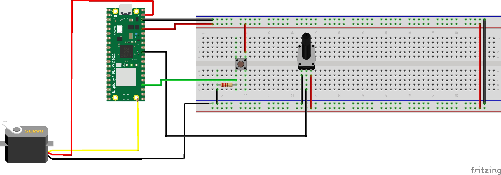
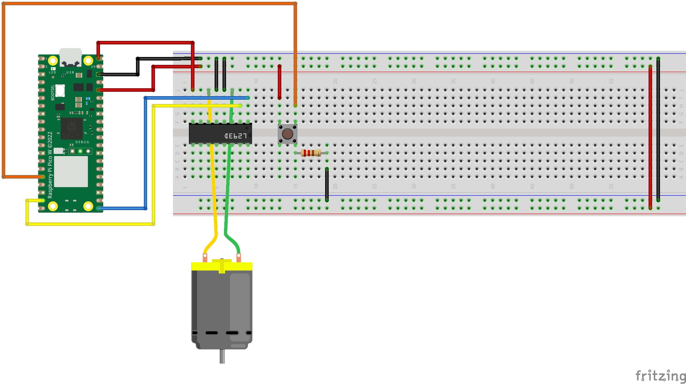
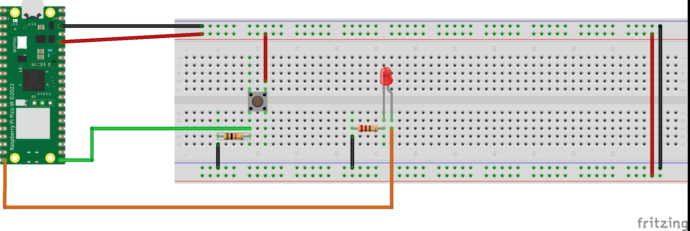
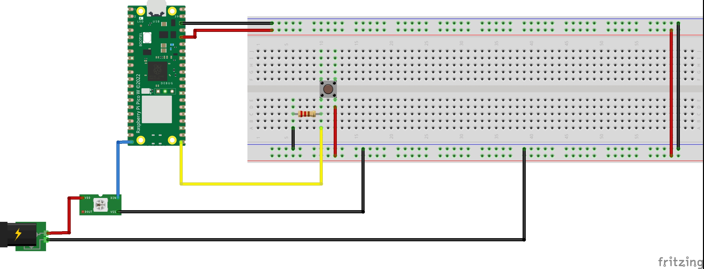
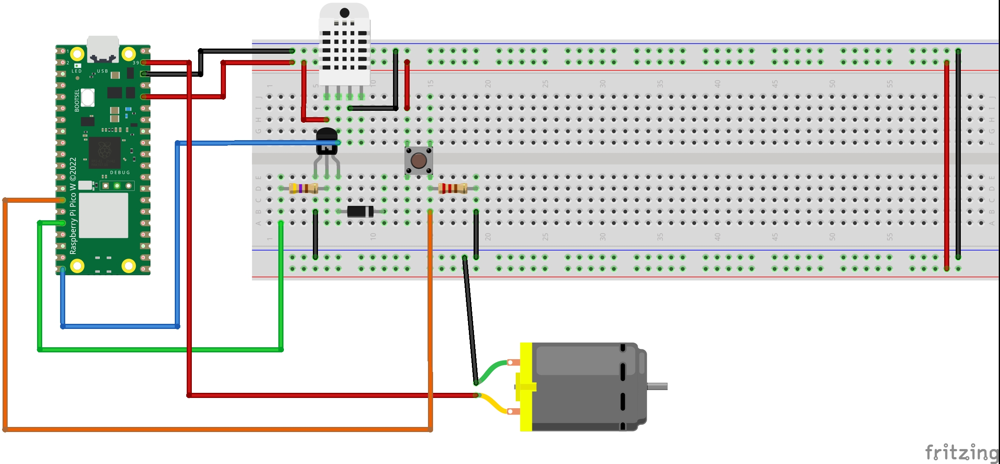

# Raspberry Pi Pico W IoT devices

This repository contains a set of Micropython scripts for the Raspberry Pi Pico W, that allows to use a Raspberry Pi Pico W to create IoT devices which can be accessible and controllable using API REST through port 80.

## Hardware Setup

In order to create an IoT device, first the components must be placed depending on the device to be created following the next section. 

### Blinds Device

**Figure 1: Blinds Setup Diagram**

### Fan Device

**Figure 2: Fan Setup Diagram**

### Light Device

**Figure 3: Light Setup Diagram**

### RGB Matrix Device

**Figure 4: RGB Matrix Setup Diagram**

### Temperature and Humidity Device

**Figure 5: Temperature and Humidity Setup Diagram**

## Software Setup

### Script placement

Once the hardware has been set up, its corresponding script must be placed into the root of the Raspberry Pi Pico W. As it is named as main.py it will run it every time it boots.

### Network configuration
It is also needed to place in the root the file wlan.py with the SSID and Password of the WLAN it will be connected to. 

### Libraries required
In the case of the RGB Matrix device as well as the Temperature and Humidity device, they need to be added a library in the root as well. 
- **RGB Matrix Device**:  
  Download the NeoPixel library from [this GitHub repository](https://github.com/blaz-r/pi_pico_neopixel).  
  The library file is found in the following location:  
  `pi_pico_neopixel/neopixel.py`.

- **Temperature and Humidity Device**:  
  Download the DHT11 sensor library from [this GitHub repository](https://github.com/ikornaselur/pico-libs).  
  The library file is found in the following location:  
  `pico-libs/src/dht11/dht.py`.

## API REST documentation

### Blinds device 

| **ENDPOINT**               | **METHOD** | **DESCRIPTION**                                      | **REPLY**                  | **PARAMETER 1** | **VALUE OF PARAMETER 1** |
|----------------------------|------------|------------------------------------------------------|----------------------------|-----------------|--------------------------|
| /turn_blinds_percentage     | POST       | Turns the blind (servomotor) to a certain percentage | HTTP status code            | percentage      | [0, 100]                 |
| /check_status               | GET        | Check the position (percentage) of the blinds        | HTTP status code + position |                 |                          |

**Table 1: API REST endpoints of the blinds device**

### Fan Device

| **ENDPOINT**           | **METHOD** | **DESCRIPTION**                      | **REPLY**                          | **PARAMETER 1** | **VALUE OF PARAMETER 1** |
|------------------------|------------|--------------------------------------|------------------------------------|-----------------|--------------------------|
| /change_status_fan      | POST       | Turn fan on/off                      | HTTP status code                   | status          | [on, off]                 |
| /check_status_fan       | GET        | Check the status of the fan          | HTTP status code + fan status      |                 |                          |
| /toggle_fan             | POST       | Toggle the status of the fan         | HTTP status code                   |                 |                          |

**Table 2: API REST endpoints of the fan device**

### Light Device

| **ENDPOINT**     | **METHOD** | **DESCRIPTION**             | **REPLY**                          | **PARAMETER 1** | **VALUE OF PARAMETER 1** |
|------------------|------------|-----------------------------|------------------------------------|-----------------|--------------------------|
| /change_status   | POST       | Turn light on/off            | HTTP status code                   | status          | [on, off]                 |
| /check_status    | GET        | Check the values of the light| HTTP status code + LED status      |                 |                          |
| /toggle          | POST       | Toggle the status            | HTTP status code                   |                 |                          |

**Table 3: API REST endpoints of the light device**

### RGB Matrix Device

| **ENDPOINT**     | **METHOD** | **DESCRIPTION**                              | **REPLY**                          | **PARAM 1** | **VALUE OF PARAM 1** | **PARAM 2** | **VALUE OF PARAM 2** | **PARAM 3** | **VALUE OF PARAM 3** | **PARAM 4**  | **VALUE OF PARAM 4** |
|------------------|------------|----------------------------------------------|------------------------------------|-------------|----------------------|-------------|----------------------|-------------|----------------------|--------------|----------------------|
| /change_color    | POST       | Change the color and brightness of the matrix| HTTP status code                   | red         | [0, 255]              | green       | [0, 255]              | blue        | [0, 255]              | brightness   | [0, 255]              |
| /check_status    | GET        | Check the values of the RGB and brightness   | HTTP status code + values of RGB and brightness |             |                      |             |                      |             |                      |              |                      |

**Table 4: API REST endpoints of the RGB Matrix device**

### Temperature and Humidity Device

| **ENDPOINT**     | **METHOD** | **DESCRIPTION**                         | **REPLY**                          | **PARAMETER 1** | **VALUE OF PARAMETER 1** |
|------------------|------------|-----------------------------------------|------------------------------------|-----------------|--------------------------|
| /check_dht       | GET        | Check the temperature and humidity      | HTTP status code + JSON with humidity and temperature |                 |                          |

**Table 5: API REST endpoint of the Temperature and Humidity device**
